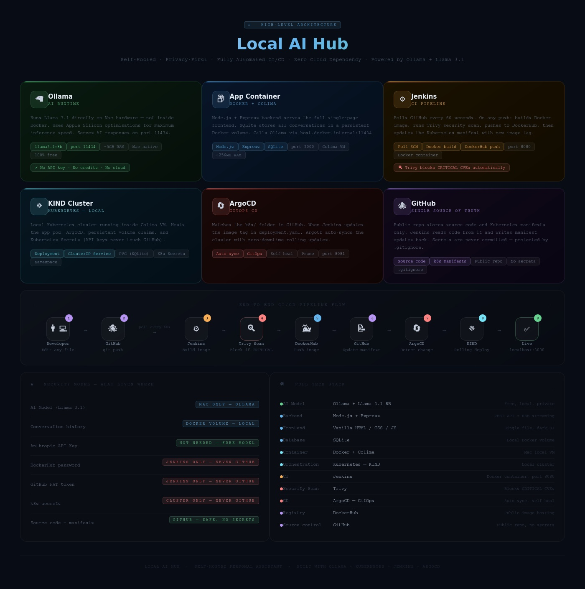

# Local AI Hub — Self-Hosted Personal AI Assistant

A fully local, privacy-first AI assistant that runs entirely on your machine.
No API keys. No cloud. No subscriptions. Powered by **Ollama** + **Llama 3.1**.

---

## Architecture



```
┌─────────────────────────────────────────────────────────────────────┐
│                          YOUR MAC                                    │
│                                                                      │
│   ┌─────────────────┐         ┌──────────────────────────────────┐  │
│   │   OLLAMA        │         │   COLIMA (Linux VM)              │  │
│   │                 │         │                                  │  │
│   │  llama3.1:8b    │◄────────│   ┌──────────────────────────┐  │  │
│   │  ~5GB RAM       │  calls  │   │  Docker Container        │  │  │
│   │  port: 11434    │         │   │                          │  │  │
│   │                 │         │   │  Node.js + Express       │  │  │
│   │  Runs on Mac    │         │   │  Frontend (HTML/CSS/JS)  │  │  │
│   │  directly       │         │   │  SQLite Database         │  │  │
│   │  (fastest)      │         │   │  port: 3000              │  │  │
│   └─────────────────┘         │   └──────────────────────────┘  │  │
│                                └──────────────────────────────────┘  │
│                                                                      │
│   ┌──────────────────────────────────────────────────────────────┐  │
│   │   KIND Cluster (local Kubernetes)                            │  │
│   │                                                              │  │
│   │   ┌─────────────┐    watches     ┌────────────────────────┐ │  │
│   │   │   ArgoCD    │───────────────►│  GitHub (k8s manifests)│ │  │
│   │   │             │◄───────────────│                        │ │  │
│   │   └──────┬──────┘    sync        └────────────────────────┘ │  │
│   │          │ deploys                                           │  │
│   │   ┌──────▼──────┐                                           │  │
│   │   │  App Pod    │                                           │  │
│   │   │  (claude)   │                                           │  │
│   │   └─────────────┘                                           │  │
│   └──────────────────────────────────────────────────────────────┘  │
│                                                                      │
│   ┌──────────────────────────────────────────────────────────────┐  │
│   │   JENKINS (Docker container)                                 │  │
│   │                                                              │  │
│   │   On every git push:                                         │  │
│   │   1. Build Docker image                                      │  │
│   │   2. Trivy security scan  ──► CRITICAL found? ──► BLOCKS ❌  │  │
│   │   3. Push image to DockerHub                                 │  │
│   │   4. Update k8s/deployment.yaml with new image tag          │  │
│   │   5. Push manifest to GitHub ──► ArgoCD picks it up ✅      │  │
│   └──────────────────────────────────────────────────────────────┘  │
└─────────────────────────────────────────────────────────────────────┘
```

---

## CI/CD Pipeline Flow

```
You edit any file
       │
       ▼
  git push → GitHub
       │
       ▼ (Poll SCM every 1 min)
    Jenkins
       │
  ┌────▼────────────────────────┐
  │ 1. Checkout code            │
  │ 2. docker build             │
  │ 3. trivy scan               │──► CRITICAL CVE? ──► ❌ Pipeline blocked
  │ 4. docker push → DockerHub  │
  │ 5. update k8s/deployment    │
  │ 6. git push manifest        │
  └────────────────────────────-┘
       │
       ▼
  ArgoCD detects manifest change
       │
  ┌────▼──────────────────┐
  │ Pull new image        │
  │ Rolling pod update    │
  │ Zero downtime   ✅    │
  └───────────────────────┘
```

---

## Tech Stack

| Layer | Technology |
|---|---|
| AI Model | Ollama + Llama 3.1 8B (local, free, private) |
| Backend | Node.js + Express |
| Frontend | Vanilla HTML/CSS/JS (single file) |
| Database | SQLite (Docker volume — local only) |
| Container Runtime | Docker + Colima |
| Orchestration | Kubernetes (KIND — local cluster) |
| CI | Jenkins (Docker container) |
| CD | ArgoCD (GitOps) |
| Security Scan | Trivy (blocks CRITICAL CVEs) |
| Image Registry | DockerHub |
| Source Control | GitHub (public — no secrets ever committed) |

---

## What You Get

- **6 built-in AI experts** — Nutritionist, Life Advisor, Medical Info, Job Hunter, Finance Advisor, Tech Expert
- **Persistent memory** — each expert remembers your full conversation history
- **Custom experts** — create your own with custom system prompts
- **100% free AI** — Ollama runs Llama 3.1 locally, no API costs ever
- **100% private** — everything stays on your machine, nothing sent externally
- **Streaming responses** — see the AI reply in real time as it types
- **Full CI/CD** — push code and it deploys automatically

---

## Prerequisites

- Mac with 16GB RAM (recommended)
- [Homebrew](https://brew.sh)
- [Colima](https://github.com/abiosoft/colima) + Docker CLI
- [kubectl](https://kubernetes.io/docs/tasks/tools/)
- [KIND](https://kind.sigs.k8s.io/)
- [Ollama](https://ollama.com)
- Jenkins running as Docker container
- ArgoCD installed on KIND cluster
- [DockerHub](https://hub.docker.com) account
- [GitHub](https://github.com) account

---

## Quick Start (Local Docker only — no CI/CD)

```bash
# 1. Install and start Ollama
brew install ollama
ollama serve                    # keep this terminal open

# 2. Pull the model (one time download ~5GB)
ollama pull llama3.1:8b

# 3. Start Colima
colima start --cpu 2 --memory 4

# 4. Build and run
docker-compose up --build -d

# 5. Open browser
open http://localhost:3000
```

---

## Full Setup (CI/CD with Jenkins + ArgoCD + KIND)

### Start infrastructure
```bash
colima start --cpu 2 --memory 4
ollama serve
ollama pull llama3.1:8b         # if not already pulled
```

### Apply Kubernetes resources
```bash
kubectl apply -f k8s/namespace.yaml
kubectl apply -f k8s/pvc.yaml
kubectl apply -f k8s/deployment.yaml
kubectl apply -f k8s/service.yaml
```

### Create API secret on cluster (never touches GitHub)
```bash
chmod +x scripts/create-secret.sh
./scripts/create-secret.sh
```

### Access the app
```bash
kubectl port-forward svc/claude-local 3000:3000 -n claude-local
open http://localhost:3000
```

### Access ArgoCD
```bash
kubectl port-forward svc/argocd-server 8081:443 -n argocd

# Get admin password
kubectl -n argocd get secret argocd-initial-admin-secret \
  -o jsonpath="{.data.password}" | base64 -d && echo
```
Open **https://localhost:8081**

### Access Jenkins
Open **http://localhost:8080**

---

## Daily Workflow

```bash
# Start everything
~/start-local-ai.sh

# Stop everything
~/stop-local-ai.sh
```

### Deploy a change
```bash
# Edit any file then:
git add .
git commit -m "your change"
git pull --rebase origin main
git push

# Jenkins detects it within 1 minute → builds → scans → deploys
# Monitor: http://localhost:8080  (Jenkins)
#          https://localhost:8081 (ArgoCD)
#          http://localhost:3000  (App)
```

---

## Useful Commands

```bash
# ── Ollama ────────────────────────────────────────────
ollama serve                                  # start Ollama
ollama ps                                     # check running models
ollama stop llama3.1:8b                       # unload model (free 5GB RAM)
ollama list                                   # list installed models
ollama pull llama3.2:3b                       # pull lighter/faster model

# ── Docker ────────────────────────────────────────────
docker-compose up --build -d                  # build and start
docker-compose down                           # stop
docker-compose logs -f                        # view logs

# ── Kubernetes ────────────────────────────────────────
kubectl get all -n claude-local               # all resources
kubectl get pods -n claude-local              # pod status
kubectl logs -f deployment/claude-local -n claude-local
kubectl rollout restart deployment/claude-local -n claude-local
kubectl rollout status deployment/claude-local -n claude-local

# ── ArgoCD ────────────────────────────────────────────
argocd login localhost:8081 --insecure --username admin
argocd app list                               # list apps
argocd app sync claude-local                  # manual sync
argocd app get claude-local                   # app details
argocd repo list                              # check repo connections

# ── Colima ────────────────────────────────────────────
colima start --cpu 2 --memory 4               # start
colima stop                                   # stop
colima status                                 # check status
```

---

## Backup & Restore

```bash
# Backup conversations
docker run --rm -v claude-data:/data -v $(pwd):/backup alpine \
  cp /data/conversations.db /backup/conversations-backup.db

# Restore conversations
docker run --rm -v claude-data:/data -v $(pwd):/backup alpine \
  cp /backup/conversations-backup.db /data/conversations.db
```

---

## Changing the AI Model

Edit `docker-compose.yml`:
```yaml
environment:
  - OLLAMA_MODEL=llama3.2:3b    # lighter, faster
  # - OLLAMA_MODEL=mistral      # better reasoning
  # - OLLAMA_MODEL=deepseek-r1:8b  # good for coding
```

Pull the model first, then rebuild:
```bash
ollama pull llama3.2:3b
docker-compose up --build -d
```

---

## Adding Custom Experts

Click **"+ Add Expert"** in the sidebar:
- **Icon** — any emoji
- **Name** — e.g. Fitness Coach
- **Color** — accent colour
- **Description** — short subtitle
- **System Prompt** — full personality and instructions

Experts added via UI are saved in the database and survive rebuilds. ✅

---

## Security Model

| Secret | Where it lives | In GitHub? |
|---|---|---|
| AI model | Your Mac (Ollama) | ❌ Never |
| Conversation history | Docker volume (SQLite) | ❌ Never |
| DockerHub password | Jenkins Credentials | ❌ Never |
| GitHub PAT | Jenkins Credentials | ❌ Never |
| App source code | GitHub | ✅ Safe |
| k8s manifests | GitHub | ✅ Safe (no secrets) |

---

## Troubleshooting

**"Cannot connect to Ollama" banner:**
```bash
ollama serve    # make sure this is running in a terminal
```

**Pod not starting:**
```bash
kubectl describe pod -n claude-local
kubectl logs -n claude-local -l app=claude-local
```

**ArgoCD sync unknown:**
```bash
argocd app get claude-local
argocd app sync claude-local
```

**Jenkins can't run Docker:**
```bash
docker exec -u root jenkins chmod 666 /var/run/docker.sock
```

**Git push rejected:**
```bash
git pull --rebase origin main && git push
```

**Port already in use:**
```bash
lsof -i :3000
```

---

## Project Structure

```
local-claude/
├── backend/
│   ├── server.js              ← Express API + Ollama integration
│   └── package.json
├── frontend/
│   └── public/
│       └── index.html         ← Complete single-page UI
├── k8s/
│   ├── namespace.yaml         ← Kubernetes namespace
│   ├── pvc.yaml               ← Persistent storage for SQLite
│   ├── deployment.yaml        ← App deployment (Jenkins updates image tag)
│   ├── service.yaml           ← ClusterIP service (no external port)
│   ├── argocd-app.yaml        ← ArgoCD GitOps application
│   └── secret.template.yaml  ← Template only — never commit real values
├── scripts/
│   └── create-secret.sh       ← Safely injects secrets onto cluster
├── Dockerfile
├── docker-compose.yml
├── Jenkinsfile                ← Full CI pipeline
├── .env.example               ← Safe placeholder — no real values
├── .gitignore                 ← Blocks secrets from GitHub
└── README.md
```

---

Built for personal use — free, private, and fully yours.
